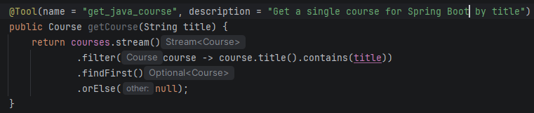
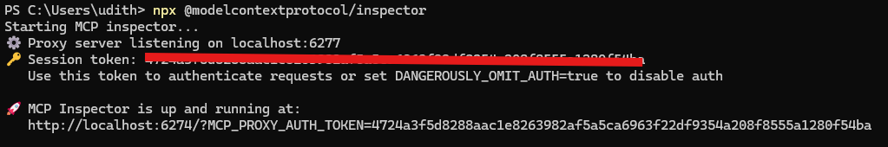
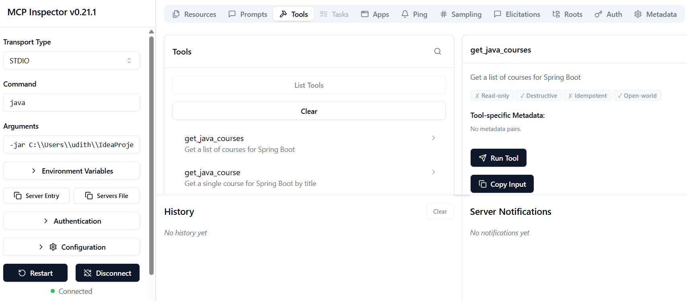
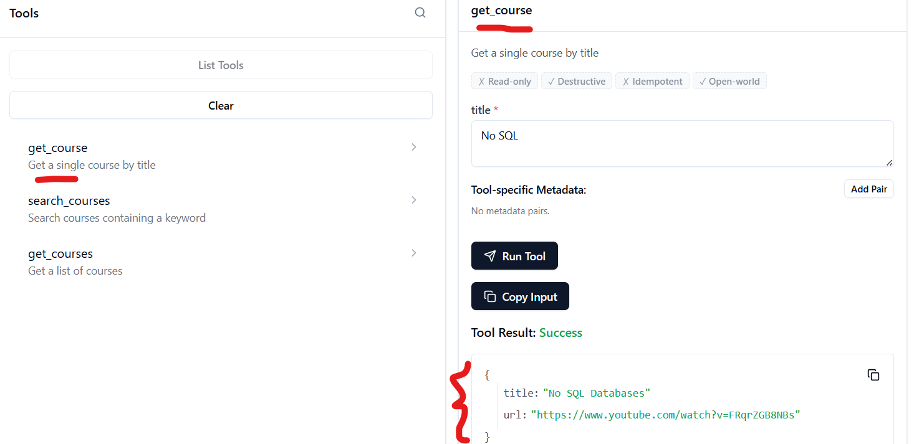

# Spring AI MCP Server for Course Information

## Overview

Implements the Model Context Protocol (MCP) server for providing course information
for integrating external data sources with AI models through Spring AI.

The server exposes two main tools:

* A tool to retrieve all available courses
* A tool to search for specific courses by title

### Tools & Frameworks used

* Java 21
* Spring Boot 3.5.11
* Spring AI 1.1.2
* MCP Inspector
* Claude Desktop

### Project setup

1. pom.xml dependencies

       <dependency>
         <groupId>org.springframework.boot</groupId>
         <artifactId>spring-boot-starter-web</artifactId>
       </dependency>

       <dependency>
   	     <groupId>org.springframework.ai</groupId>
   		 <artifactId>spring-ai-starter-mcp-server</artifactId>
   	   </dependency>

2. Project structure to understand the components:

   * Course.java : Record for course data
   * CourseService.java: Service with MCP tool annotations providing the actual course data.
      
     
     The @Tool annotation transforms regular methods into MCP-compatible tools with:
      * A unique name for identification
      * A description that helps AI models understand the tool's purpose

   * CoursesApplication.java: Main application class with tool registration
   * application.yaml: Configuration for the MCP server and disable web app

3. The application is configured to run as a non-web application using STDIO transport for MCP communication:
            
       spring:
         application:
           name: CourseTool
         main:
           web-application-type: none
           banner-mode: off
         ai:
           mcp:
             server:
               name: spring-ai-courses
               version: 1.0.0
            
       logging:
         pattern:
           console:

### Run application

1. build the application jar (under target)

       mvn clean package

2. run MCP inspector from terminal

3. MCP Inspector connected and Tools displayed

### Test the MCP Server - Course tool

1. click on of the tools available. 
   e.g: get cource
2. enter a title in the text box 
   e.g: No SQL

3. shoulbe be able to view the relavent response
  

4. Optionally - Connect from Claude Desktop and connect to the Tool running in MCP server to answer related to the course questions.

